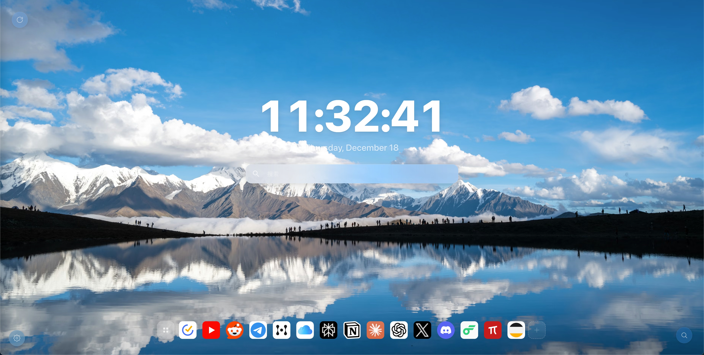
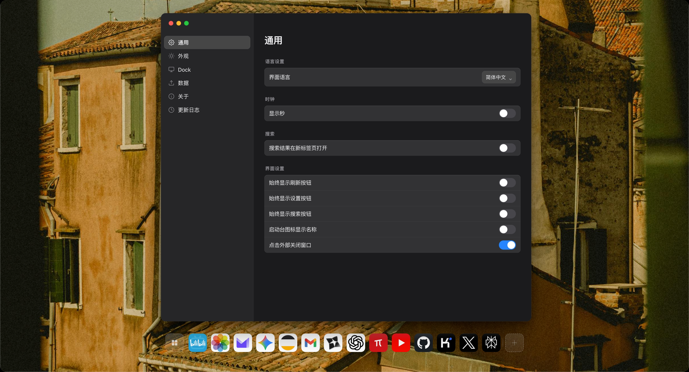
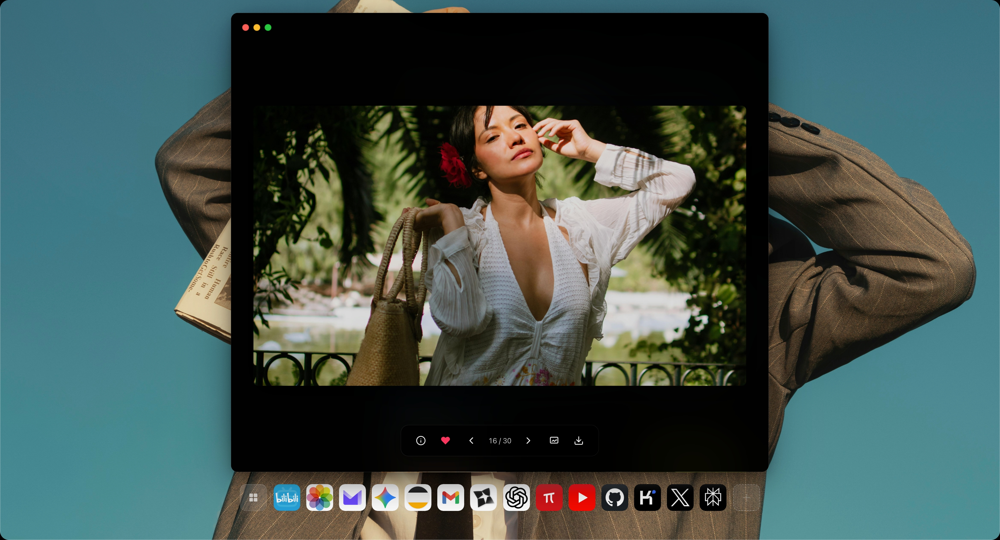
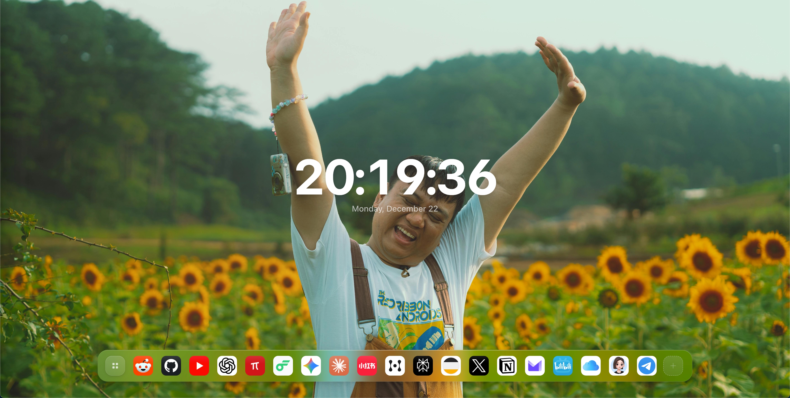

# Aura Tab

[](https://github.com/nil-byte/aura-tab/actions)
[](https://opensource.org/licenses/MIT)
[](https://github.com/nil-byte/aura-tab/releases)

A beautiful, customizable New Tab page for Chrome/Edge browsers with smart backgrounds, quick links management, and immersive photo viewing.

[English](#features) | [中文](#功能特性)

---

## Features

- 🎨 **Smart Backgrounds**: Auto-crop based on screen size with focal point detection
- 🖼️ **Multiple Sources**: Support for local files, Unsplash, Pixabay, and Pexels
- 🔗 **Quick Links Manager**: Folder support, drag-and-drop, search, and pagination
- 🎬 **Smooth Transitions**: Beautiful fade animations when switching backgrounds
- 🌐 **i18n Support**: Full Chinese (Simplified/Traditional) and English localization
- ⚡ **Performance First**: First Paint optimization, background caching with TTL
- 🎭 **Toolbar Icon Customization**: Upload and apply your own toolbar icons
- 📱 **Responsive Design**: Adapts to different screen sizes and densities
- 🔒 **Privacy Focused**: WebDAV backup support for Nutstore, Synology NAS, etc.

## Screenshots

### Main Interface


### Quick Links & Launchpad



### Settings Window



### Photo Viewer



### More Features




## Installation

### Chrome Web Store (Recommended)

Coming soon...

### Manual Installation (Developer Mode)

1. Download the latest release from [Releases](https://github.com/nil-byte/aura-tab/releases)
2. Unzip the file
3. Open Chrome/Edge and navigate to `chrome://extensions` or `edge://extensions`
4. Enable "Developer mode" in the top right
5. Click "Load unpacked" and select the unzipped folder
6. Open a new tab to see Aura Tab in action!

## Development

### Prerequisites

- Node.js 18+ 
- npm or pnpm

### Setup

```bash
# Clone the repository
git clone https://github.com/nil-byte/aura-tab.git
cd aura-tab

# Install dependencies
npm install

# Run tests
npm test

# Run tests with coverage
npm run test:coverage

# Run tests in watch mode
npm run test:watch
```

### Project Structure

```
Aura-Tab/
├── scripts/
│   ├── boot/           # First paint optimization
│   ├── domains/        # Feature modules (DDD architecture)
│   │   ├── backgrounds/    # Background system
│   │   ├── quicklinks/     # Quick links & launchpad
│   │   ├── settings/       # Settings window
│   │   └── ...
│   ├── platform/       # Platform abstractions
│   └── shared/         # Shared utilities
├── tests/              # Test files (Vitest)
├── styles/             # CSS styles
├── assets/             # Icons, backgrounds
└── _locales/           # i18n translations
```

### Architecture

This project follows **Domain-Driven Design (DDD)** principles:

- **Domain Layer**: Business logic organized by feature domains
- **Platform Layer**: Abstracted storage, lifecycle, and messaging
- **Shared Layer**: Common utilities and helpers

## Contributing

We welcome contributions! Please see [CONTRIBUTING.md](CONTRIBUTING.md) for guidelines.

### Quick Start for Contributors

1. Fork the repository
2. Create your feature branch: `git checkout -b feature/amazing-feature`
3. Commit your changes: `git commit -m 'feat: add amazing feature'`
4. Push to the branch: `git push origin feature/amazing-feature`
5. Open a Pull Request

### Commit Convention

We follow [Conventional Commits](https://www.conventionalcommits.org/):

- `feat:` New feature
- `fix:` Bug fix
- `docs:` Documentation changes
- `test:` Adding or updating tests
- `refactor:` Code refactoring
- `perf:` Performance improvements

## Roadmap

- [ ] Chrome Web Store publication
- [ ] Firefox support
- [ ] Weather widget
- [ ] Todo list integration
- [ ] More background sources
- [ ] Custom CSS themes

## Changelog

See [assets/changelog.json](assets/changelog.json) for detailed version history.

### Latest (v2.7.0)

- i18n Support: Full Chinese and English localization
- Smart Background Cropping: Auto-crop based on screen size
- Background Transitions: Smooth fade animations
- First Paint Optimization: Faster initial load
- Toolbar Icon Customization: Upload custom icons
- Launchpad Folder Enhancement: Pin to Dock support
- Background Cache Management: Configurable TTL and limits
- Immersive Photo Viewer: Fullscreen browsing experience

## License

This project is licensed under the MIT License - see [LICENSE](LICENSE) for details.

## Acknowledgments

- [Unsplash](https://unsplash.com) for beautiful images
- [Interact.js](https://interactjs.io) for drag-and-drop functionality
- [SortableJS](https://sortablejs.github.io) for sorting capabilities
- [fflate](https://github.com/101arrowz/fflate) for compression

---

## 功能特性

- 🎨 **智能背景裁剪**：根据屏幕尺寸和焦点自动裁剪
- 🖼️ **多源支持**：本地文件、Unsplash、Pixabay、Pexels
- 🔗 **快速链接管理器**：文件夹支持、拖拽排序、搜索、分页
- 🎬 **平滑过渡动画**：切换背景时淡入淡出效果
- 🌐 **国际化**：完整的中英文（简/繁）支持
- ⚡ **性能优先**：首屏优化、背景缓存、TTL 管理
- 🎭 **工具栏图标定制**：上传并应用自定义图标
- 📱 **响应式设计**：适配不同屏幕尺寸
- 🔒 **隐私保护**：支持 WebDAV 备份（坚果云、群晖等）

## 安装

### 手动安装（开发者模式）

1. 下载最新版本
2. 解压文件
3. 打开 Chrome/Edge，访问 `chrome://extensions` 或 `edge://extensions`
4. 开启右上角"开发者模式"
5. 点击"加载已解压的扩展程序"，选择解压后的文件夹
6. 打开新标签页即可使用

## 感谢

如果这个项目对你有帮助，请给个 ⭐ Star！
